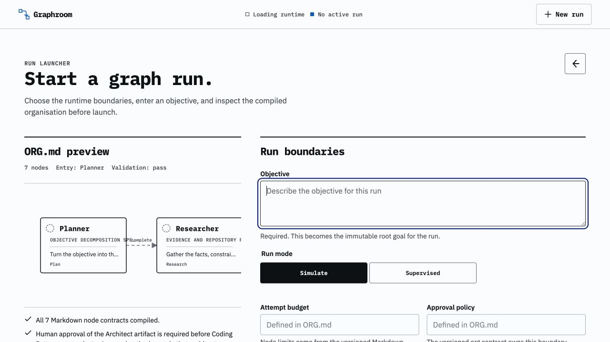
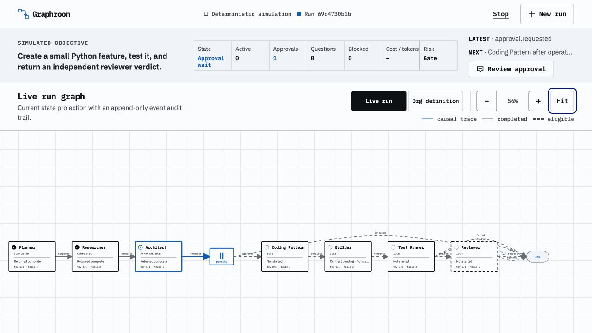
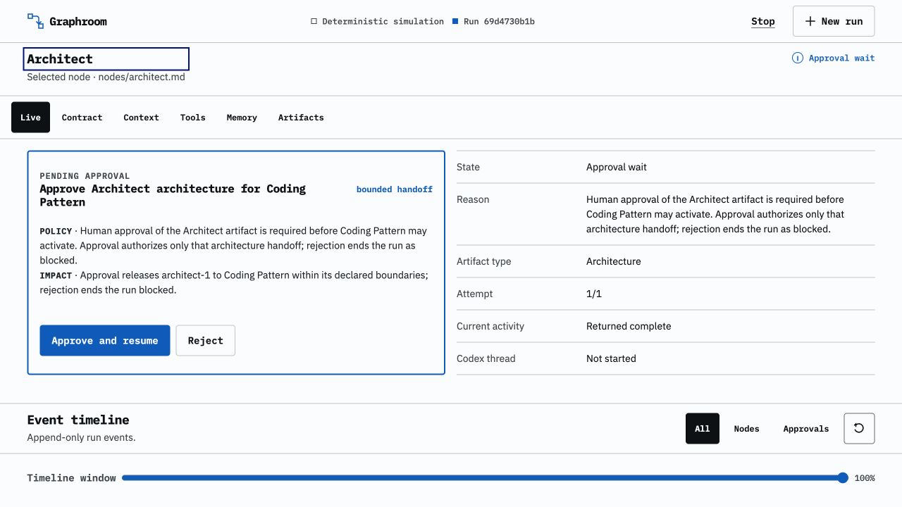
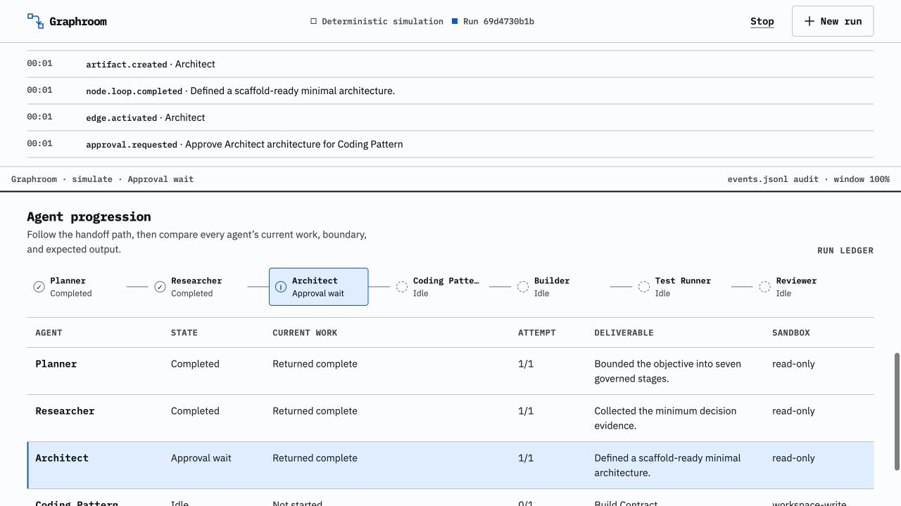

# Graphroom

Graphroom turns one coding objective into a small team of Codex workers you can actually watch.

Instead of giving one long prompt to one all-powerful agent, Graphroom breaks the work into seven clear jobs. Each job has its own Markdown contract, its own allowed tools, its own sandbox, and one expected deliverable. When a job becomes eligible, Graphroom starts a fresh Codex CLI thread for it, follows the live event stream, saves the result, and decides what can happen next.

Codex is still the worker. Graphroom is the manager.



_Before a run starts, you can see the objective, mode, approval policy, memory boundary, and the organisation compiled from `ORG.md`._

## The simple idea

Codex is very good at taking a bounded task, reading the workspace, using tools, changing code, and returning a result. It is much harder to trust one enormous session to plan, research, design, build, test, review itself, and remember every boundary along the way.

Graphroom leans into the first part and takes care of the second.

The default organisation is:

> Objective → Planner → Researcher → Architect → Human approval → Coding Pattern → Builder → Test Runner → Reviewer

| Worker | Its one job | Workspace access |
| --- | --- | --- |
| Planner | Turn the objective into a bounded plan | Read-only |
| Researcher | Gather the evidence and constraints | Read-only |
| Architect | Define the smallest workable architecture | Read-only |
| Coding Pattern | Create the scaffold and binding build contract | Workspace write |
| Builder | Implement only inside the approved contract | Workspace write |
| Test Runner | Run the required checks and return evidence | Read-only |
| Reviewer | Independently decide whether the work passes | Read-only |

The graph owns routing, approval, limits, and final completion. A worker cannot quietly skip ahead or declare the whole run finished.

## How Graphroom spins up Codex work

In **Supervised** mode, this is what happens each time a node becomes active:

1. Graphroom reads that node's contract from `nodes/*.md`.
2. It builds a small context packet with the objective, relevant earlier artifacts, approval state, build contract, and verified memory.
3. It starts a new `codex exec` process in the run workspace. The node's contract decides whether that thread is read-only or may write to the workspace.
4. Codex emits JSON events while it reasons and uses tools. Graphroom records the thread ID, tool activity, token usage, commands, and result in the run audit log.
5. The final response must match a structured schema and include an artifact plus evidence. A friendly-sounding answer is not enough.
6. Graphroom checks policy, records the handoff, and activates only the matching edge to the next job.

Every node activation is therefore a real, separately observable Codex work thread—not another character pretending to be an agent inside one shared chat. Codex's own multi-agent delegation is disabled inside these workers so the organisation stays visible and the graph remains in control.

Each supervised run gets an isolated working area:

```text
runs/<run-id>/
├── agents/<node-id>/
│   ├── result.schema.json
│   ├── result-<attempt>.json
│   └── codex-<attempt>.jsonl
├── workspace/
├── state.json
└── events.jsonl
```

`state.json` is the current picture. `events.jsonl` is the append-only story of how the run got there.

## A run is visible from end to end



_The same graph powers deterministic demos and supervised Codex runs. Completed work, the active handoff, eligible routes, failure routes, and the final reviewer are all visible._

The graph is more than a diagram. Every line is an executable handoff condition. The UI projects the actual runtime state, so a completed box means the node returned a valid artifact and evidence—not merely that an animation finished.

### Human approval is a real pause



_The Coding Pattern worker cannot start until the architecture handoff is approved. Rejecting it ends the run as blocked._

Approvals live in the runtime, not in a prompt. That matters because the next Codex thread is never created until the graph receives the decision. The operator can see what is being released, which worker will receive it, and what boundary still applies.

### The bottom of the page is the run ledger



_The ledger makes it easy to compare every worker's state, current activity, attempt count, deliverable, and sandbox without clicking through the graph._

You can also inspect a node's live state, contract, exact context packet, tools, memory, and artifacts. The event timeline provides the ordered audit trail underneath it all.

## Run it locally

```bash
git clone https://github.com/Akshay-a/AI-Agents.git
cd AI-Agents/AI-GraphAgent

python3 -m venv .venv
source .venv/bin/activate
pip install -r requirements.txt

uvicorn app:app --reload
```

Open [http://localhost:8000](http://localhost:8000).

Use **Simulate** first. It runs the full graph with deterministic workers, including the approval pause, without calling Codex.

For **Supervised** mode, make sure the Codex CLI is installed, authenticated, and available on your `PATH` before starting Graphroom:

```bash
codex --version
```

Then choose **Supervised** in the launcher. Graphroom will start the Codex workers only as their nodes become eligible.

## Shape the organisation in Markdown

- `ORG.md` defines the nodes, edges, entry point, completion node, approval policy, and memory policy.
- `nodes/*.md` defines each worker's responsibility, sandbox, limits, artifact type, and input/output contract.
- `app.py` compiles those files, runs the graph, starts Codex workers, enforces boundaries, and exposes the API.
- `prototype/` contains the browser control room.

Useful optional environment settings:

| Variable | Purpose |
| --- | --- |
| `CODEX_BIN` | Use a specific Codex executable |
| `CODEX_MODEL` | Choose the model used by supervised workers |
| `GRAPHROOM_DATA_DIR` | Store run state somewhere other than `runs/` |
| `GRAPHROOM_SIM_DELAY` | Slow down or speed up simulated nodes |
| `SUPERMEMORY_API_KEY` | Enable scoped, read-only memory recall |

## What this prototype proves

Graphroom is deliberately small. It proves that a useful agent organisation does not need seven agents talking endlessly to one another. It needs seven bounded jobs, clean handoffs, visible evidence, and a manager that knows when to stop.

The current version keeps LangGraph checkpoints in memory, stores run truth locally, uses one explicit approval gate, and executes nodes sequentially. Those constraints are intentional: the goal is to make real Codex work understandable and governable before making the organisation larger.
